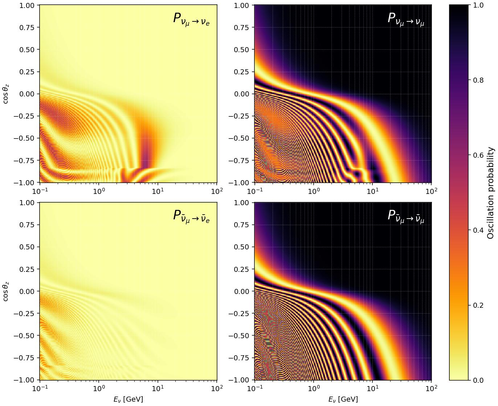

# jaxnu

[](https://github.com/pgranger23/jaxnu-osc/actions/workflows/ci.yml)
[](LICENSE)

**A differentiable neutrino oscillation calculator in [JAX](https://docs.jax.dev).**

`jaxnu` computes neutrino oscillation probabilities in **vacuum**, **constant-density
matter**, **non-constant density** (the Earth via the PREM model, with an
atmospheric production height), arbitrary **user profiles**, and the **Sun**
(adiabatic MSW). Everything is `jit`-compilable, `vmap`-batchable, and
**differentiable end-to-end** — with respect to the oscillation parameters *and* the
geometry (zenith angle, baseline, energy). **Non-standard interactions (NSI)** and
**sterile neutrinos (3+N)** are first-class.

It is validated to machine precision against the established codes
[OscProb](https://github.com/joaoabcoelho/OscProb) and
[NuFast](https://github.com/PeterDenton), and reproduces the reference plots of the
[nu-waves](https://github.com/nadrino/nu-waves) library.



*Atmospheric oscillograms through the PREM Earth: ν/ν̄ × (μ→e, μ→μ) over
(energy, cos θ_z), showing the MSW resonance, the matter ν/ν̄ asymmetry, the
core–mantle boundary at cos θ_z ≈ −0.84, and near-horizon atmospheric oscillations.*

---

## Why another oscillation code?

The established fast codes (NuFast, OscProb, Prob3++, …) are excellent at forward
evaluation but are not differentiable. `jaxnu` is built **autodiff-first**: you get
exact gradients of any probability with respect to any input for free, which is what
you want inside a JAX fitting / HMC / neural-network pipeline. The cost of all six
oscillation-parameter gradients is ~3–5× a single forward evaluation (vs ~12× noisy
evaluations for finite differences), and the same code runs batched on GPU/TPU.

---

## Installation

```bash
git clone https://github.com/pgranger23/jaxnu-osc.git
cd jaxnu-osc
pip install -e .                 # core: jax + numpy
pip install -e ".[examples]"     # + matplotlib for the example scripts
pip install -e ".[diffrax]"      # + diffrax for the optional stiff ODE backend
pip install -e ".[test]"         # + pytest
```

> **Float64 is required** for oscillation phases (Δm² ~ 1e−3 eV²) and is enabled
> automatically on `import jaxnu`.

---

## Quick start

```python
import jax, jax.numpy as jnp
import jaxnu
from jaxnu import nufit_no, Flavor

params = nufit_no()                       # a NuFIT-like normal-ordering point
E  = jnp.linspace(1.0, 25.0, 200)         # GeV
cz = jnp.linspace(-1.0, -0.05, 150)       # cos(zenith), up-going

# Atmospheric oscillogram P(νμ → νe) through the Earth, shape (n_cz, n_E)
P = jaxnu.probability_earth(params, E, cz,
                            flavor_in=Flavor.MU, flavor_out=Flavor.E)

# Exact gradient w.r.t. every oscillation parameter (returns an OscParams of grads)
def loss(p):
    return jaxnu.probability_earth(p, jnp.asarray(4.0), jnp.asarray(-1.0),
                                   flavor_in=Flavor.MU, flavor_out=Flavor.E)
grads = jax.grad(loss)(params)            # grads.theta23, grads.dm31, grads.deltacp, ...
```

Probability matrices have shape `(..., N, N)` indexed `P[β, α] = P(ν_α → ν_β)`;
pass `flavor_in` / `flavor_out` to select one channel. Antineutrinos: `anti=True`.
`Flavor.E, Flavor.MU, Flavor.TAU = 0, 1, 2` (sterile flavors are indices ≥ 3).

### The five regimes

```python
# vacuum
jaxnu.probability_vacuum(params, E, baseline_km=295.0)                      # T2K-like

# constant-density matter
jaxnu.probability_constant(params, E, baseline_km=1300.0, density=2.8, ye=0.5)  # DUNE-like

# PREM Earth (+ optional atmosphere); single entrypoint
jaxnu.probability_earth(params, E, cz,
                        ye_core=0.466, ye_mantle=0.494,   # configurable two-zone Y_e
                        h_atm_km=15.0,                    # production height -> full cosz
                        n_sub=4, det_depth_km=0.0)

# arbitrary piecewise-constant profile (source -> detector ordering)
jaxnu.probability_profile(params, E, density_gcc=[...], ye=[...], length_km=[...])

# solar adiabatic MSW: vacuum mass-state fractions vs radius
prof = jaxnu.solar.load_bs05("examples/data/bs05_agsop.dat")
F = jaxnu.solar.adiabatic_mass_fractions(params, E_GeV, prof, r_km, r_emit_km)
```

### NSI and sterile neutrinos

```python
# matter NSI: an epsilon_{alpha beta} object on any probability function
P = jaxnu.probability_constant(params, E, 1300.0, density=2.8,
                               nsi=jaxnu.NSI(eps_emu=0.1 + 0.05j, eps_ee=0.05))

# 3+1 sterile (flavors e, mu, tau, s); the matter potential automatically gives
# sterile flavors only the relative neutral-current term; backend auto-switches to eigh
st = jaxnu.Sterile3plus1(theta12, theta13, theta23, theta14, theta24, theta34,
                         delta13, delta24, dm21, dm31, dm41)
P = jaxnu.probability_earth(st, E, cz)            # (n_cz, n_E, 4, 4)

# arbitrary 3+N via the generic builder
U = jaxnu.pmns_nflavor(5, [(3, 4, 0.1), (2, 4, 0.05), ..., (0, 1, theta12)])
params5 = jaxnu.NFlavorParams(U=U, msq=jnp.array([0, dm21, dm31, dm41, dm51]), n_active=3)
```

Both NSI and sterile parameters are differentiable leaves — `jax.grad` works through
`NSI(...)` and `Sterile3plus1(...)`.

---

## Algorithm choices

This section documents *why* each numerical method was chosen.

### Units and precision

The numerical core runs **entirely in natural units** (`ħ = c = 1`): energies in eV,
lengths in eV⁻¹, masses² in eV². Unit conversions (GeV, km, g/cm³) and the matter
potential happen only at the API boundary (`constants.py`), derived from
first-principles CODATA/PDG values — there are no opaque literals like `7.6e-14`.
The charged-current potential is `V_CC = √2 G_F N_e`; sterile neutrinos additionally
feel the relative neutral-current term `½√2 G_F N_n`. **float64/complex128** is
mandatory and set on import: at float32 the large oscillation phases lose precision
(float32 buys only ~1.06× on CPU and ~1e−6 accuracy loss — not worth it except
possibly on GPU).

### Propagation backends

The evolution of a constant-density layer is `S = exp(−iHL)`; `P_{αβ} = |S_{βα}|²`.
Four backends, agreeing to ~1e−14:

| backend | method | used for |
|---------|--------|----------|
| **`nufast`** | analytic NuFast-LBL formula (default for constant density / vacuum) | single layer, standard 3-flavor |
| **`cayley`** | Cayley–Hamilton via Newton divided differences (default for the Earth path) | layered Earth, all cases |
| **`eigh`** | generic Hermitian eigendecomposition | any N (steriles), validation |
| **`expm`** | `jax.scipy.linalg.expm` | reference cross-check |

- **`nufast`** ports Parke & Denton's NuFast-LBL ("DMP Rosetta") algorithm: the
  matter mixing-matrix magnitudes `|Uᵐ_{αi}|²` and the matter Jarlskog are computed
  **analytically from the eigenvalues** and plugged straight into the standard `sin²`
  probability formula — no eigenvectors, no matrix exponential, no matmuls. It is
  exact (matches the matrix-exponential backends to ~5e−15), differentiable, and
  several times faster, putting constant-density throughput on par with NuFast's C++.
  It applies only to a single constant-density layer and standard 3-flavor, so it
  **falls back automatically** to `cayley`/`eigh` when NSI or steriles are present.
- **`cayley`** is the default for the multi-layer Earth path because there you need
  the evolution operator `S` (to chain across layers), not just probabilities. It
  uses the **analytic 3×3 Hermitian eigenvalues** (stable trigonometric solution of
  the characteristic cubic) and the **Newton divided-difference (Hermite) form** of
  `exp(−iM)` — which is eigenvector-free, handles repeated / zero eigenvalues exactly
  (so zero-length Earth segments collapse to identity cleanly), and avoids the
  ill-conditioning of a naive Vandermonde solve (the raw Hamiltonian eigenvalues are
  ~1e−13 eV, so it works with the dimensionless `M = HL` instead).
- **`eigh`** handles `N ≠ 3` (sterile models) and is the generic validation oracle.
  The backend is auto-switched to `eigh` for `N ≠ 3` since the analytic kernels are
  3×3-specific.

### Earth model and geometry (`earth.py`)

- **PREM** (Dziewonski & Anderson 1981) density as piecewise polynomials in radius;
  a **two-zone `Y_e`** (core/mantle, boundary at 3480 km) that is user-configurable
  (`ye_core` / `ye_mantle`) to match whatever convention you are comparing against.
- **One unified entrypoint** (`probability_earth` → `earth.chord_segments`) covers
  up-going through the Earth, down-going, *and* the atmospheric production height
  `h_atm_km` (so down-going / near-horizon directions get the correct vacuum
  baseline). Geometry uses the distance-from-closest-approach coordinate
  `d(r) = √(r²−r_min²)`; PREM shell boundaries are respected exactly.
- **Layer placement, NuFast-style.** Shells are allocated **proportional to radial
  thickness** (not `n_sub` per PREM region), so resolution goes to the thick
  core/mantle where the oscillation phase accumulates rather than to thin crust
  layers; density is sampled at each segment's **path midpoint** (not the shell's
  geometric midpoint). Together these converge ~3–5× faster in `n_sub`: e.g.
  `n_sub=2` (25 shells) reaches ~3e−3 accuracy, better than naive uniform
  subdivision at 121 shells.

### Layer product (`layers.py`), device-aware

The per-layer operators are chained `S = S_N ⋯ S_1`. Two strategies, auto-selected:

- **CPU:** a sequential `lax.scan` — least total work and memory; fastest where there
  is no parallel hardware to exploit.
- **GPU/TPU:** build all per-layer propagators with `vmap` (vectorized eigensolves,
  hoisting the layer-independent vacuum Hamiltonian) and combine with
  `lax.associative_scan` (parallel-prefix, O(log N) depth).

(The parallel-prefix product is *slower* on CPU because it computes all prefixes;
benchmarking confirmed the sequential scan wins on CPU, so it is the CPU default.)

### Differentiability

- The `cayley` divided differences and the analytic eigensolver are **guarded with
  double-`where`** so degenerate / zero-length segments carry no NaN gradients
  (`sqrt` has an infinite derivative at 0).
- The Earth chord geometry uses a **gradient-safe `sqrt`** at the turning point
  (closest approach), where the geometric vertical tangent would otherwise NaN
  `dP/d cos θ_z`. Autodiff matches finite differences for parameters *and* geometry.
- Antineutrinos are a conjugation/sign flag (`U → U*`, `V → −V`, `ε → ε*`), not a
  separate code path, so gradients flow identically.

### Continuous (ODE) backend (`ode.py`)

For arbitrary smooth profiles (and as an independent cross-check of the layer
method), `jaxnu.ode` integrates `dS/ds = −iH(s)S` directly. Two solvers: `odeint`
(default, no extra dependency) and an optional **diffrax** backend
(`backend="diffrax"`, `solver="dopri8"`/`"kvaerno5"`/…) with stiff/implicit solvers
and checkpointed adjoints — most useful for hard profiles (e.g. supernovae). The
diffrax path evolves a real `[Re S, Im S]` state (diffrax complex support is
experimental). These are only approximately unitary (RK drifts off the unitary
group), so they are *not* on the default path; the layer method is exact per layer.

### Solar adiabatic MSW (`solar.py`)

A BS05-style standard-solar-model loader (or an analytic exponential profile) plus
the **averaged adiabatic** mass-state fractions
`F_i(r) = Σ_k |⟨ν_i^vac|ν_k^m(r)⟩|² · |⟨ν_k^m(r_emit)|ν_e⟩|²` — the textbook LMA-MSW
result (a ν_e produced in the dense core emerges predominantly as ν₂).

---

## Validation

`python run_tests.py` (or `pytest`) — **33 checks**, including:

- vacuum two-flavor analytic limit; unitarity in vacuum & matter; CP asymmetry; MSW;
- exact Earth chord geometry; oscillogram unitarity, no NaNs; down-going → vacuum;
- cross-backend agreement (`nufast` / `cayley` / `eigh` / `expm`) to ~1e−14;
- autodiff vs finite differences for oscillation parameters *and* `cos θ_z`; `jit`;
- NSI(0) → standard, sterile(θ_i4=0) → 3-flavor, reactor-sterile RAA depth,
  3+2 unitarity, gradients through NSI / sterile params;
- ODE (odeint & diffrax) vs the layer method.

**External cross-code validation** (see [validation/README.md](validation/README.md)):

| comparison | constant density | PREM Earth |
|---|---|---|
| vs **OscProb** (ROOT/Eigen) | ~1e−9 | ~1e−7 (identical path) |
| vs **NuFast** (C++) | 5e−13 (constants aligned) | ~1e−5 (converged) |

The residual vs NuFast is fully explained by NuFast's 6-significant-figure constants;
jaxnu and OscProb (which share first-principles constants) agree to ~1e−9 despite
completely different propagators. Reference values are embedded as regression tests
(`tests/test_oscprob_reference.py`, `tests/test_nufast_reference.py`).

### Reproductions of the nu-waves reference plots

[`examples/nuwaves/`](examples/nuwaves) reproduces all six figures from the nu-waves
README (vacuum PMNS, sterile + energy smearing, constant-density NO/IO, (E,L) maps,
the atmospheric oscillogram, solar adiabatic MSW) — five match essentially exactly;
the solar one reproduces the correct MSW physics (see that folder's README for the
convention note). [`examples/nsi_sterile.py`](examples/nsi_sterile.py) demonstrates
the NSI and sterile front-ends.

---

## Performance (Apple M3 Pro, CPU, float64)

| workload | jaxnu | NuFast (C++) | OscProb (C++) |
|---|---|---|---|
| constant density, P(νμ→νe) | **37–94 Mevals/s** (`nufast` backend) | 28 | 14 |
| PREM Earth oscillogram | ~0.04–0.07 Mevals/s | 51 | 0.5 |
| all 6 param gradients | **2.9–5.4× a forward eval** (exact) | n/a (finite diff ≈ 12×) | n/a |

`jaxnu` matches or beats the hand-optimized C++ for the constant-density/LBL case
(the `nufast` backend is a single analytic formula, no scan). For PREM Earth on CPU
it is much slower: the cost is XLA per-op overhead on the sequential scan of tiny 3×3
ops, not the algorithm — NuFast-Earth's analytic per-layer machinery is in a
different class on CPU. jaxnu's Earth value is differentiability + GPU/TPU batching
(where the gap closes). See [DESIGN.md](DESIGN.md) §11 for the GPU-oriented
NuFast-Earth roadmap item.

---

## Module map

```
jaxnu/
  constants.py   physical constants + unit conversions + matter potentials
  params.py      OscParams PyTree (differentiable leaves) + a benchmark point
  pmns.py        generic N-flavor PMNS construction
  hamiltonian.py vacuum + matter Hamiltonian (generic N, NSI + sterile)
  eigensolve.py  analytic 3x3 Hermitian eigenvalues
  propagator.py  exp(-iHL): cayley / eigh / expm
  nufast.py      fast analytic constant-density probability (NuFast-LBL port)
  layers.py      device-aware layered propagation
  earth.py       PREM + chord geometry + thickness-proportional shells
  oscillator.py  high-level API (vacuum / constant / earth / profile)
  nsi.py         non-standard interactions
  sterile.py     3+N sterile front-end
  solar.py       solar profile + adiabatic MSW
  ode.py         continuous-density backend (odeint / diffrax)
```

---

## Limitations & roadmap

- **3-flavor** is the core; **sterile (3+N)** and **matter NSI** are implemented.
- CPU Earth throughput is far below the specialized C++ codes (see Performance). A
  **GPU-oriented NuFast-Earth propagator** (eigensystem caching across cos θ_z +
  reduced-basis real per-shell amplitudes + symmetric-trajectory halving) is the
  roadmap item to close that gap on accelerators — [DESIGN.md](DESIGN.md) §11.
- A **supernova module** would be the natural consumer of the diffrax stiff backend.

---

## References & acknowledgements

- PREM: Dziewonski & Anderson, *Phys. Earth Planet. Inter.* **25** (1981) 297.
- NuFast / DMP: Parke & Denton, *NuFast* (arXiv:2405.02400); Denton, Minakata & Parke
  (arXiv:1604.08167). The `nufast` backend ports the public
  [NuFast-LBL](https://github.com/PeterDenton/NuFast-LBL) algorithm.
- Validated against [OscProb](https://github.com/joaoabcoelho/OscProb) and
  [NuFast](https://github.com/PeterDenton); reproduces
  [nu-waves](https://github.com/nadrino/nu-waves) reference plots.
- Solar profile: Bahcall, Serenelli & Basu, BS05(AGS,OP) standard solar model.

## License

MIT — see [LICENSE](LICENSE).
